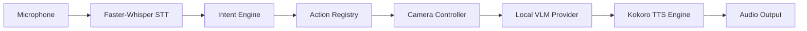

# CYNEXIS — AI Vision System Architecture

## 1. Subsystem Architecture
The CYNEXIS Vision system connects the optical camera feed to local vision-language processing models and audio narration:

## 2. Vision-Language Model (VLM) Specifications
* **Target Offline Model**: `vikhyatk/moondream2` (Revision `2024-08-26`)
* **Alternative Lightweight Model**: `HuggingFaceTB/SmolVLM-256M-Instruct`
* **Format**: Hugging Face PyTorch / Safetensors
* **Quantization**: `float32` (CPU) / `int8` (CUDA)
* **Local Storage Directory**: `./AI Models/VLM/`
* **System Requirements**: 4 GB RAM (CPU) / 2 GB VRAM (GPU)
* **Inference Latency**: ~1.5s - 3.5s (CPU) / ~300ms (GPU)
* **Offline Status**: 100% offline once model weights are present in `./AI Models/VLM/`.

## 3. Strict Safety & Actuator Isolation Rules
1. **Zero Motor Control from Vision**: The Vision Provider and VLM output **text descriptions only**. They have no authority or direct interface to invoke rover or arm actuators.
2. **Intent & Safety Enforcement**: All robot movements must pass through the `SafetyValidator` and `ActionRegistry`.
3. **No DRIFT Action**: High-speed slip/drift actions are permanently excluded from the system.
