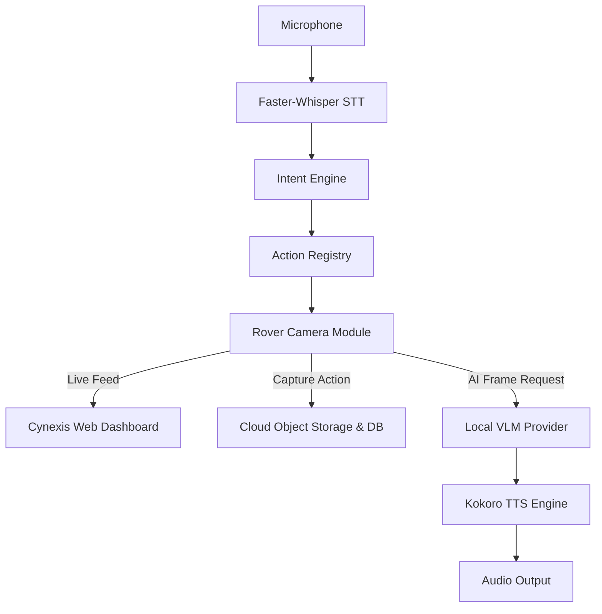

# CYNEXIS — AI Vision System Architecture

## 1. Subsystem Architecture
The CYNEXIS Vision system connects the optical camera feed to live streaming, cloud storage, local vision-language processing models (VLM), and audio narration:

```mermaid
graph TD
    Camera[Rover Camera Module] -->|Live Feed| WebDash[Cynexis Web Dashboard]
    Camera -->|Capture Action| CloudStorage[Cloud Object Storage & DB]
    Camera -->|AI Frame Request| VLM[Local VLM Provider]
    Mic[Microphone] --> FasterWhisper[Faster-Whisper STT]
    FasterWhisper --> IntentEngine[Intent Engine]
    IntentEngine --> ActionRegistry[Action Registry]
    ActionRegistry --> Camera
    VLM --> Kokoro[Kokoro TTS Engine]
    Kokoro --> Speaker[Audio Output]
```

## 2. Visual Data Pipeline & Separation
To optimize bandwidth and compute resources, visual data is split into three distinct pipelines:
1. **Live Feed Stream**: Low-latency MJPEG video delivered directly to the Web Dashboard for human operator teleoperation.
2. **Cloud Photo Artifacts**: High-resolution photographs captured on command, enriched with timestamp, camera status, and optional GPS metadata, then committed to Cloud Object Storage and Database index.
3. **AI Vision Frames**: Ephemeral single frames extracted on demand for local VLM processing when the agent receives visual queries (e.g. *"What is in front of the rover?"*).

## 3. Vision-Language Model (VLM) Specifications
* **Target Offline Model**: `vikhyatk/moondream2` (Revision `2024-08-26`)
* **Alternative Lightweight Model**: `HuggingFaceTB/SmolVLM-256M-Instruct`
* **Format**: Hugging Face PyTorch / Safetensors
* **Quantization**: `float32` (CPU) / `int8` (CUDA)
* **Local Storage Directory**: `./AI Models/VLM/`
* **System Requirements**: 4 GB RAM (CPU) / 2 GB VRAM (GPU)
* **Inference Latency**: ~1.5s - 3.5s (CPU) / ~300ms (GPU)
* **Offline Status**: 100% offline once model weights are present in `./AI Models/VLM/`.

## 4. Strict Safety & Actuator Isolation Rules
1. **Zero Motor Control from Vision**: The Vision Provider and VLM output **text descriptions only**. They have no authority or direct interface to invoke rover or arm actuators.
2. **Intent & Safety Enforcement**: All robot movements must pass through the `SafetyValidator` and `ActionRegistry`.
3. **No DRIFT Action**: High-speed slip/drift actions are permanently excluded from the system.
